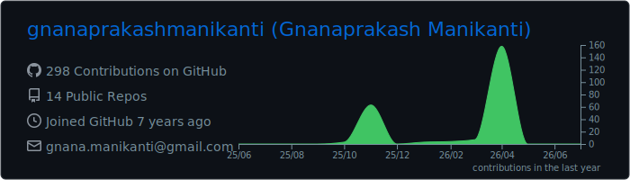
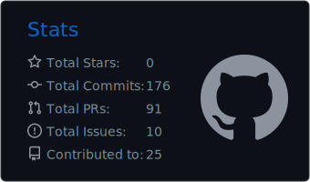
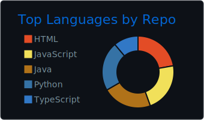

# Hi, I'm Gnana Prakash Manikanti 👋

Software Engineer with 3+ years of experience in scalable distributed systems, microservices, and cloud-native backend platforms. MS in IT from Illinois Institute of Technology, Chicago.

📍 Chicago, IL · 📧 gnanapmanikanti@gmail.com

---

## 🛠 Tech Stack

**Backend:** Java (8–21), Spring Boot, Spring Security, Hibernate, Python Node.js, FastAPI, GraphQL, REST APIs

**AI/ML:** Spring AI, LangChain, LangGraph, LlamaIndex, RAG, OpenAI, Vector Databases

**Cloud & DevOps:** AWS (EKS, RDS, S3, IAM), Docker, Kubernetes, Terraform, Jenkins, GitHub Actions, ArgoCD

**Databases & Messaging:** PostgreSQL, MongoDB, DynamoDB, Kafka, Redis

**Observability:** OpenTelemetry, Prometheus, Grafana, Loki, Tempo

**Frontend:** React.js, AngularJS, Next.js

---

## 🚀 Featured Projects

**[CubeMart - Production Microservices Platform](https://github.com/CubeMart))** — microservices with gRPC, Kafka event-driven messaging, Resilience4J, and an AI Shopping Assistant using LangChain RAG + pgvector.

**[Agentic Document Intelligence Platform](https://github.com/gnanaprakashmanikanti)** — Agentic RAG platform with LangGraph, query routing, multi-step retrieval from Qdrant, and real-time SSE streaming on Google Cloud Run.

**[ModelForge - AI Model Control Plane](https://github.com/gnanaprakashmanikanti)** — ML model deployment platform on AWS EKS with Terraform, ArgoCD GitOps, HPA autoscaling, and Prometheus/Grafana observability.

---

## 📊 GitHub Stats

  

  

  
  

---

## 💼 Experience

**Full Stack Developer Intern** · Saayam For All · Sep 2025 – Present

**Software Engineer** · Infosys · Mar 2022 – Sep 2023

**Software Engineer** · Mphasis · Nov 2020 – Feb 2022

---

## 🎓 Education

**MS in Information Technology** · Illinois Institute of Technology · 2023–2025

**BS in Electronics & Communication** · SRM University · 2017–2021
